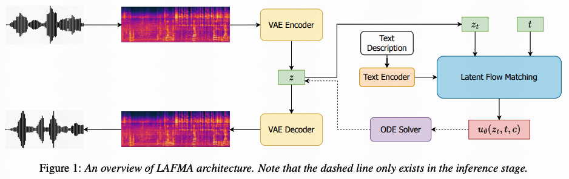

# LAFMA
Official implementation of the paper "LAFMA: A Latent Flow Matching Model for Text-to-Audio Generation" (INTERSPEECH 2024).  [Paper Link](https://arxiv.org/pdf/2406.08203.pdf) and [Demo Page](https://lafma.github.io) .



## Checkpoints

[VAEGAN Model](https://drive.google.com/file/d/1FRTMxcKHafTcDvEK-c_zRYckF25-UbjQ/view?usp=drive_link): 
The VAEGAN model is the audio VAE that compresses the audio mel-spectrogram into an audio latent.

[LAFMA Model](https://drive.google.com/file/d/1lpX8rN1GvDar4quoLfofI0UireVmuHay/view?usp=drive_link): 
The LAFAM model is the latent flow matching model for text guided audio generation model.

We use the checkpoint of HiFi-GAN vocoder provided by [AudioLDM](https://zenodo.org/records/7884686) .

## Inference
```
# install dependicies
pip install -r requirement.txt

# infer
(first download the huggingface flan-t5-large to the huggingface/flan-t5-large dir)
(replace the checkpoint_path to yours in the .sh file)
cd LAFMA 
sh egs/tta/audiolfm/run_inference.sh
```
## Acknowledgements
- [Amphion](https://github.com/open-mmlab/Amphion)
- [Fabric](https://github.com/Lightning-AI/pytorch-lightning) 
- [AudioLDM](https://github.com/haoheliu/AudioLDM)
- [Flow Matching](https://github.com/atong01/conditional-flow-matching/tree/main)


## Cites
```
@misc{guan2024lafma,
      title={LAFMA: A Latent Flow Matching Model for Text-to-Audio Generation}, 
      author={Wenhao Guan and Kaidi Wang and Wangjin Zhou and Yang Wang and Feng Deng and Hui Wang and Lin Li and Qingyang Hong and Yong Qin},
      year={2024},
      eprint={2406.08203},
      archivePrefix={arXiv},
      primaryClass={eess.AS}
}
```
